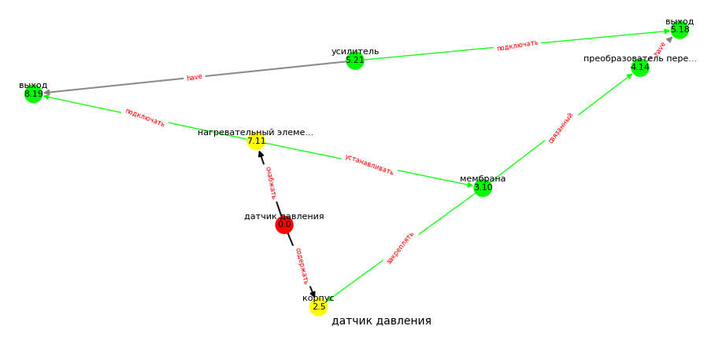

# patents-claim-handler
Прототип системы извлечения структурированных данных из русскоязычных патентов.

### Описание системы

Система извлечения морфологических признаков технических объектов из русскоязычных патентов в рамках задачи автоматизированного изобретательства. В качестве морфологических признаков выступают элементы конструкций изобретения и связи между ними (формула изобретения), а так же аспекты применения изобретения в виде формализма "решение-проблема" (технический результат). Извлеченные данные сохраняются в виде онтолгии предметной области (формат RDF/XML).

Проект в рамках выполнения магистерской диссертации ([описание метода](https://yadi.sk/i/5XddTZFEZWUHHQ)).

### Настройка окружения
Для запуска скриптов необходим интерпретатор python 3.6

1. Собрать исходник [Томита-парсер](https://github.com/yandex/tomita-parser); 
   указать абсолютный путь до исходника в классе ./tools/AppConfig (свойство TOMITA_BIN_PATH);
2. Установить python-зависимости:
- pip install ufal.udpipe
- pip install pymorphy2
- pip install pymorphy2-dicts
- pip install pymystem3
- pip install python-crfsuite
- pip install Owlready2
- pip install progressbar2
- pip install matplotlib
- pip install networkx

Используемые сторонние разработки:
- модель синтаксического анализатора для обработки русского языка [russian-gsd-ud-2.3-181115.udpipe](https://lindat.mff.cuni.cz/repository/xmlui/handle/11234/1-2898) проекта [UFAL UDPipe](http://ufal.mff.cuni.cz/udpipe)
- модель чанкера именных групп русского языка А. Феногеновой ([crf-модель](http://web-corpora.net/wsgi/chunker.wsgi/npchunker/npchunker/))

### Запуск системы
Пример пакетной обработки:

`$ python3 run.py batch --input ./data/ --output ./data/ --limit 10000 --chunksize 1000`

Пример обработки отдельного документа:

`$ python3 run.py single --patent ./data/doc1.xml --owl ./data/result.owl --print_graph`

### Входные и выходные данные
Входные файлы - русскоязычные патенты в xml-разметке (логическая структура соответствует объявлению типа документа (DTD) «ru-patent-document-v1-3.dtd»).

Выходные файлы - концептуализированные данные об изобретении и элементах его конструкции, сохраненные в файлах выгрузки онтологии (owl); [схема онтологии](external/ood_template_v2.0.owl).

### Пример построения дерева элементов конструкций

Вывод извлеченного графа элементов конструкций при использовании флага --print_graph при обработке отдельного патента:

